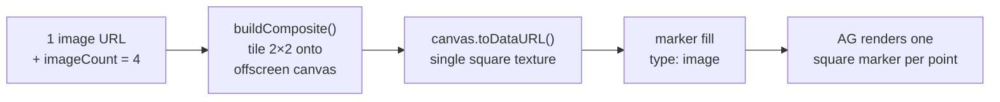
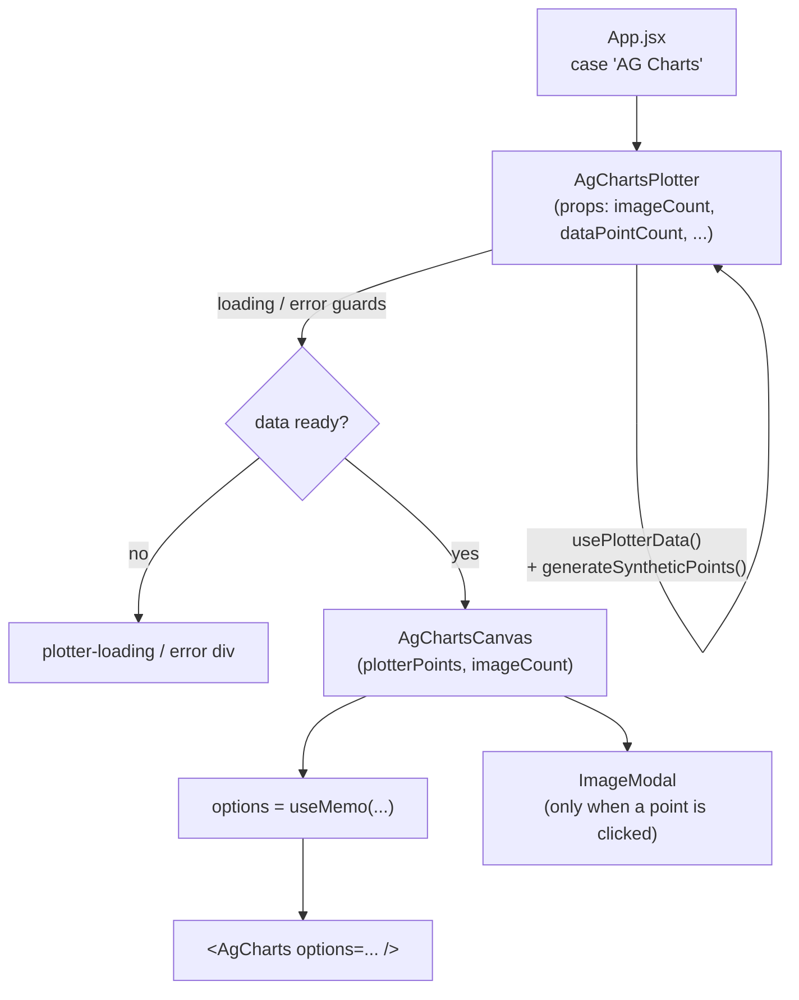
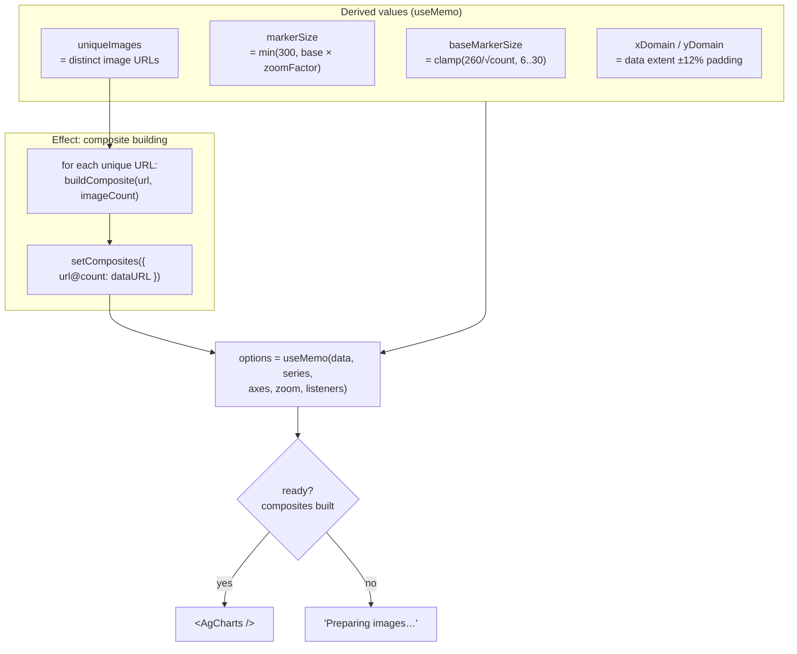
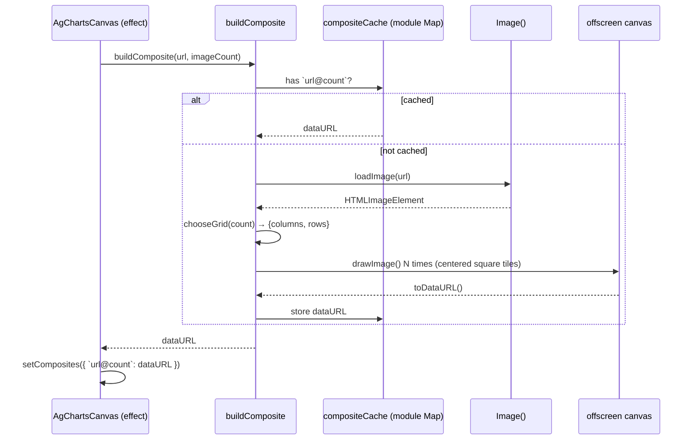
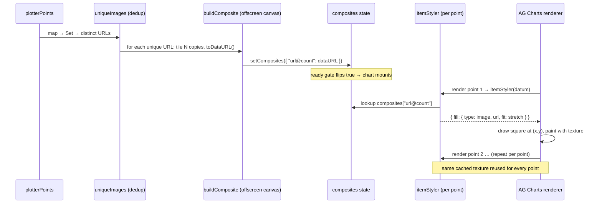
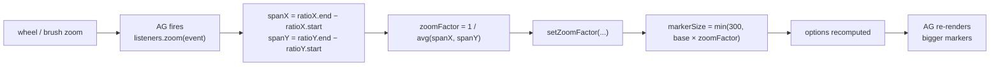
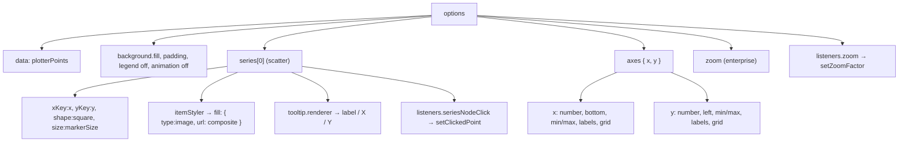

# AgChartsPlotter — Deep Dive

`src/components/AgChartsPlotter.jsx`

A plotter tab that renders the image‑scatter using **AG Charts (Enterprise)** as natively
as possible. Unlike the Recharts/D3/Pixi plotters — which hand‑roll their own zoom,
pan, brush, culling, and canvas drawing — this component delegates **rendering,
axes, zoom/pan/brush, and tooltips to AG Charts**. The only custom behavior layered
on top is *click an image → open the existing `ImageModal`*.

---

## 1. Design goal & the central constraint

The app's data model is: each point has **one image URL**, and the "images per point"
feature (`imageCount` = 1/2/4/8) means *tiling that same image N times* in a small grid
(see `lib/gridLayout.js`). Every other plotter draws those N tiles itself.

AG Charts, however, has **no native multi‑image marker** and markers are **path/shape
based** (no `drawImage`). The one escape hatch AG *does* offer is an **image fill** on a
marker (`fill: { type: "image", url }`), and `itemStyler` lets that fill vary per point.

> **Key idea:** A marker can only show *one* image fill. So to keep everything native,
> we **pre‑compose the N tiles into a single square texture** (an offscreen canvas →
> data URL) and use *that* as the marker's image fill. AG then renders one square
> marker per point, but it visually looks like the N‑tile cluster.

This is the trick that makes "multi‑image, but all through AG Charts" possible.



---

## 2. What is native vs. custom

| Concern | Who handles it | Notes |
|---|---|---|
| Drawing markers | **AG Charts** | Canvas scene graph (AG is canvas‑native) |
| Axes, grid, ticks | **AG Charts** | `axes.x` / `axes.y` dictionary |
| Wheel zoom / pan / brush‑zoom | **AG Charts Enterprise** | `zoom` module |
| Tooltip on hover | **AG Charts** | `series.tooltip.renderer` |
| Multi‑image per point | **Custom** | Pre‑composed texture (§1) |
| Marker grows on zoom | **Custom** | `zoom` event → `zoomFactor` → marker `size` (§6) |
| Domain padding / inset | **Custom** | `axes.x/y.min/max` (§5) |
| Click image → modal | **Custom** | `seriesNodeClick` → `ImageModal` |

---

## 3. Module registration (AG Charts v13)

AG Charts v13 is **fully modular** — *nothing renders* until modules are registered.
This runs once at import time, before any chart is created:

```js
import { ModuleRegistry } from "ag-charts-community";
import { AllEnterpriseModule } from "ag-charts-enterprise";

ModuleRegistry.registerModules([AllEnterpriseModule]);
```

`AllEnterpriseModule` bundles community + enterprise (scatter series, number axis,
zoom, etc.). Without a license key, enterprise features run in **trial mode**
(watermark + console notice) — acceptable for a PoC.

> ⚠️ **Gotcha learned:** in v13 a side‑effect `import "ag-charts-enterprise"` does **not**
> auto‑register modules (it did in older versions). Forgetting `registerModules`
> throws *"No modules have been registered."*

---

## 4. Component structure & data flow

Two components:

- **`AgChartsPlotter`** — the props‑facing wrapper. Resolves data (synthetic generator,
  falling back to fetched data) and handles loading/error states.
- **`AgChartsCanvas`** — owns chart state (composites, zoom factor, clicked point) and
  builds the AG Charts `options`.



### Props contract

`AgChartsPlotter` receives the shared plotter props but only uses two:

| Prop | Used? | Purpose |
|---|---|---|
| `imageCount` | ✅ | tiles per composite (1/2/4/8) |
| `dataPointCount` | ✅ | how many synthetic points to generate |
| `xGap`, `yGap` | ✖ | ignored — positions come purely from data |
| `enableQuadtree`, `enableLOD`, `enableCanvas` | ✖ | ignored — AG manages its own rendering/culling |
| `chartId` | ✖ | not used (AG owns its own zoom state) |

---

## 5. Render pipeline (what happens on each render)



- **`baseMarkerSize`** shrinks as point density rises, so a fit‑to‑data view of 1000
  points isn't one solid blob.
- **`xDomain` / `yDomain`** pad the data extent by ~12%. This keeps edge markers off
  the axis line **and** leaves a margin for tick labels.
- The **`ready` gate** (`composites` populated) means the chart only mounts once every
  texture is built — important because `itemStyler` is **synchronous** and must find a
  ready data URL.

---

## 6. The composite texture (multi‑image)

`buildComposite(url, imageCount)` produces a single square data‑URL:



Details:
- **`chooseGrid`** mirrors `lib/gridLayout.js`: 1→1×1, 2→2×1, 4→2×2, 8→4×2.
- Tiles are **square**, centered in a square canvas; non‑square grids leave
  **transparent gaps** (so the chart background shows through, matching the SVG/canvas
  plotters).
- **`compositeCache`** is module‑level, keyed by `` `${url}@${count}` ``, so textures are
  shared across chart instances (multi‑chart / virtualized mode) and survive remounts.
- Because every synthetic point shares one image URL, there is typically **one composite
  for the whole chart** — negligible cost.

---

## 6.1 Marker → image-fill flow (per unique image vs. per point)

A common misconception is that each *marker* is "converted into an image." It isn't. A
marker stays a normal AG Charts **square shape**; we simply tell AG to **paint that
square with an image instead of a solid colour** — an *image fill*. And the texture is
built **per unique image, not per point**.

There are two distinct layers, owned by two different parties:

| Layer | Owner | What it does | Frequency |
|---|---|---|---|
| **A. Build texture** | *our code* (`buildComposite`) | tile image(s) onto an offscreen canvas → `dataURL` | once **per unique `image@count`**, cached |
| **B. Paint marker** | *AG Charts* | draw a square, fill it with that texture | once **per point**, every render |

**Layer A — per unique image.** `uniqueImages` dedups the URLs across *all* points, then
the effect builds one composite per distinct URL and stores it in the `composites` map
keyed `` `${url}@${count}` ``. In the synthetic demo every point shares one URL, so
**one** texture is built and reused by all 100/500/1000 markers — not one per point.

**Layer B — per point.** The series' `itemStyler` is AG's per‑datum styling hook; AG
calls it once for every point. For each point it (1) reads `datum.image`, (2) looks up
the **already‑built** texture, (3) returns `{ fill: { type:"image", url, fit:"stretch" } }`.
AG then decodes that `dataURL` once (cached by URL internally), and on every marker draws
the square path at `(x, y)` sized `markerSize × markerSize` and fills it with the bitmap.



**So, precisely:**
- The texture is produced **once per distinct `(imageURL, imageCount)`** and cached — *not*
  once per point. 1000 points sharing one image ⇒ **one** texture.
- AG runs `itemStyler` **per point**, but that only *looks up* the cached texture; it does
  not rebuild it.
- "Marker becomes an image" really means **AG fills a square shape with an image fill**,
  the same mechanism it uses for a colour fill.

> **In the real multi‑camera case** (distinct images per row), the texture is no longer
> shared — `buildComposite` produces a **different texture per point** (keyed by that
> point's camera‑URL set), but the render flow (itemStyler → image fill → AG paints the
> square) is identical.

---

## 7. Zoom behavior — and why markers must be grown manually

AG Charts markers are a **fixed pixel size**; native zoom narrows the axis *domain* but
does **not** enlarge markers. To recreate the "images grow as you zoom in" feel of the
other plotters, we listen to AG's chart‑level `zoom` event and scale the marker size:



- `ratioX` / `ratioY` are the **visible fraction** of each axis (fully zoomed out =
  `{start:0, end:1}` → span 1 → factor 1). Zoomed to half the range → factor 2 → markers
  double in size (capped at 300px).
- No feedback loop: changing marker `size` doesn't change the zoom ratio, so the `zoom`
  event doesn't re‑fire from our own update.

**Zoom interaction map** (Enterprise `zoom` module):

| Gesture | Action |
|---|---|
| Mouse wheel | Zoom in/out (anchored to **pointer**) |
| Drag | Brush — select a rectangle to zoom into |
| Alt + drag | Pan |
| Double‑click | Reset zoom |

> `anchorPointX/Y: "pointer"` is set explicitly — AG's default anchor is the axis
> *edge* (`end`/`middle`), which feels like it zooms to the wrong place.

---

## 8. The `options` object (annotated)



- **`itemStyler`** returns `{ fill: { type:"image", url, fit:"stretch" } }` when the
  composite is ready, else `{ fillOpacity: 0 }` (hide until ready).
- **`axes`** is a **dictionary keyed `x`/`y`** (see §9), with explicit light label colors,
  `avoidCollisions: false` (never silently drop ticks), and the padded `min`/`max`.
- **`animation: { enabled: false }`** disables enter/update transitions.

---

## 9. v13 gotchas encountered (and the fixes)

These are the issues hit while building this component — documented so they're not
re‑discovered:

| Symptom | Cause | Fix |
|---|---|---|
| *"No modules have been registered."* | v13 requires explicit module registration | `ModuleRegistry.registerModules([AllEnterpriseModule])` |
| Axis tick labels invisible; console: *"Option `axes` … expecting an object, ignoring"* | v13 changed `axes` from an **array** to an **object** keyed `x`/`y`. The whole array config was discarded → default dark‑on‑dark labels, no padding | Convert `axes: [ {...}, {...} ]` → `axes: { x: {...}, y: {...} }` |
| Images don't enlarge when zooming | AG markers are fixed pixel size | `zoom` event → `zoomFactor` → marker `size` (§7) |
| Zoom jumps to the edge, not the cursor | Default anchor is `end`/`middle` | `anchorPointX/Y: "pointer"` |
| Tick labels clipped at the edge | Chart `padding` is an outer boundary applied before axes; too little on bottom/left | `padding: { bottom: 24, left: 44, … }` |

---

## 10. Limitations vs. the other plotters

- **Tile granularity in the modal:** AG's `seriesNodeClick` gives the datum but not which
  sub‑tile was clicked, so `ImageModal` opens at `initialImageIndex: 0`. (All tiles are
  the same image, so this is cosmetic.)
- **No `xGap` / `yGap`:** positions come purely from data coordinates.
- **No explicit LoD / quadtree:** AG owns culling and rendering; the `enableLOD` /
  `enableQuadtree` / `enableCanvas` toggles don't apply here.
- **Marker growth is uniform & capped (300px)** and driven off the average of the X/Y
  visible spans, so it approximates — not pixel‑matches — the content‑space scaling of
  the Recharts/D3 plotters.
- **Trial‑mode watermark** until a license key is set via `LicenseManager.setLicenseKey`.

---

## 11. File map

| Symbol | Role |
|---|---|
| `ModuleRegistry.registerModules` | One‑time v13 module setup |
| `chooseGrid(count)` | Column/row split for the tile cluster |
| `loadImage(url)` | Promise wrapper around `Image()` |
| `buildComposite(url, count)` | Builds + caches the tiled square texture |
| `AgChartsPlotter` | Props wrapper, data resolution, loading/error |
| `AgChartsCanvas` | Chart state + `options` + `<AgCharts>` + `ImageModal` |
| `compositeCache` | Module‑level texture cache |

---

*Related: `docs/RechartsNativePlotter.md` documents the hand‑rolled (non‑AG) approach
that this component is contrasted against.*
