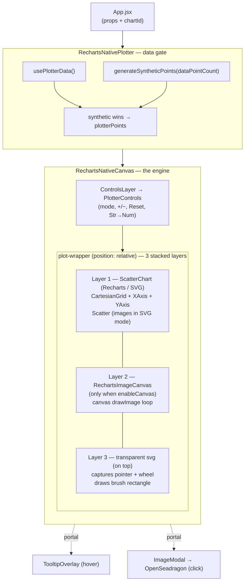
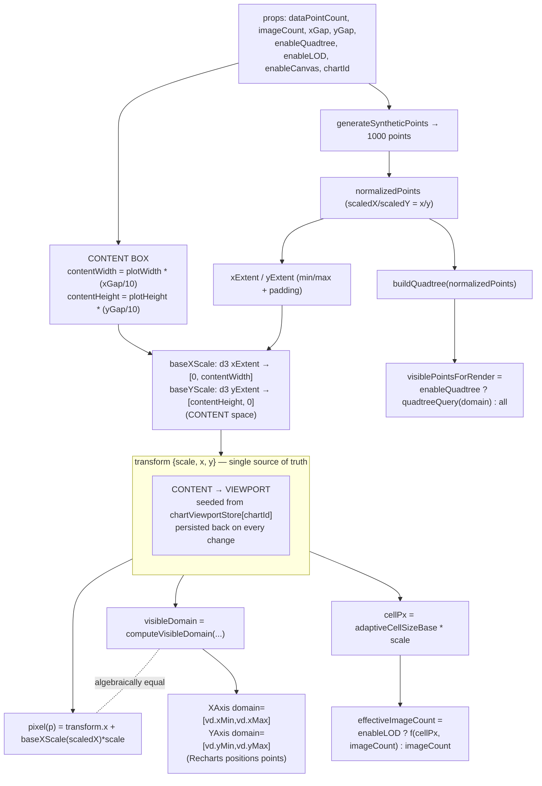
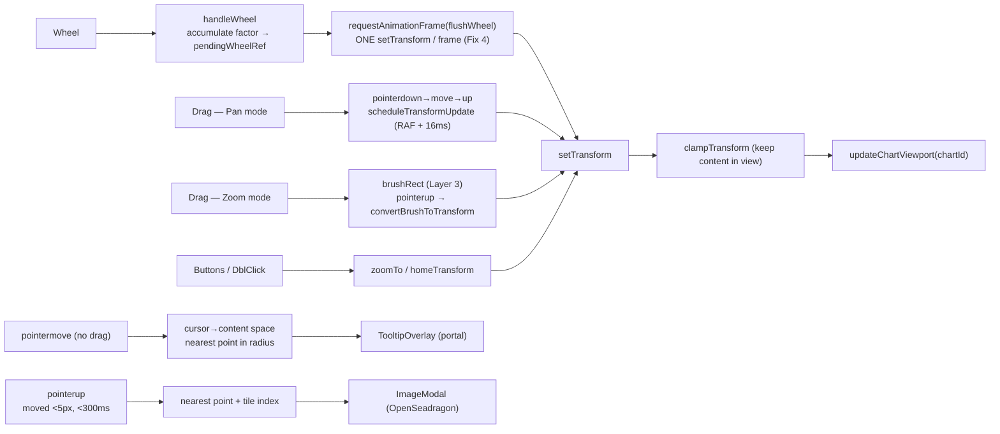
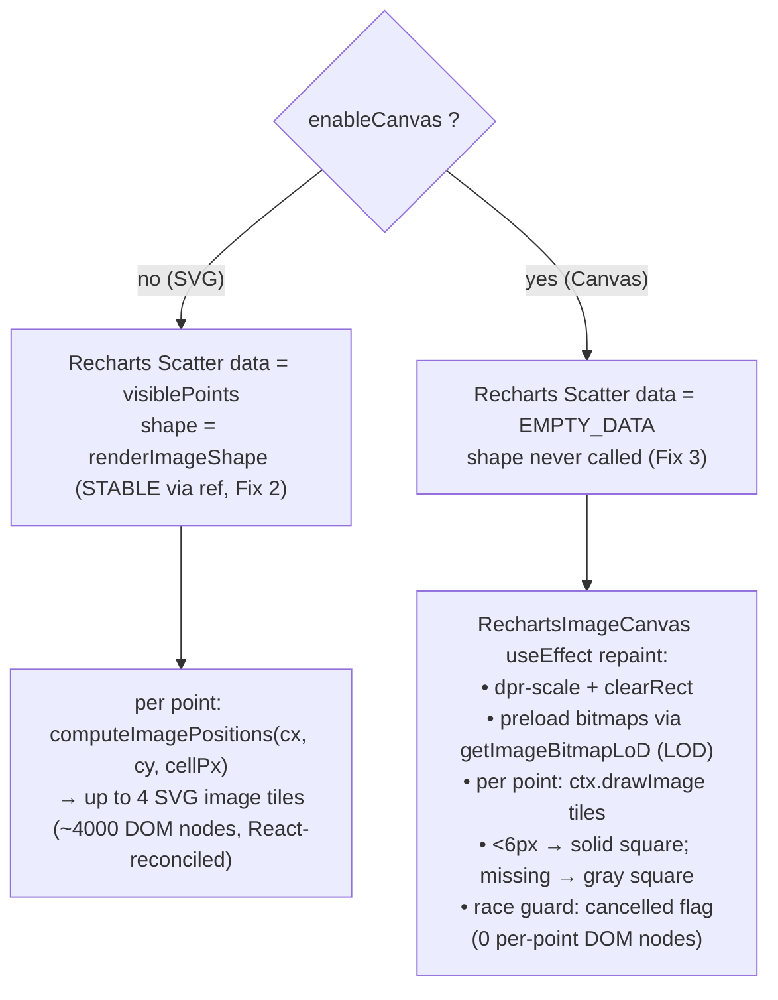
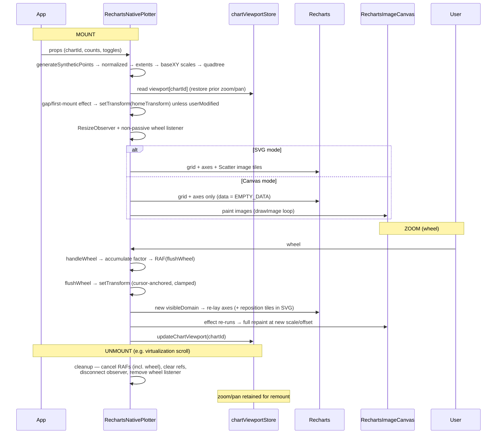

# RechartsNativePlotter — Architecture & Workflow

A genuine **Recharts-library** implementation of the image-scatter plotter, with
feature parity to the hand-rolled SVG/d3 `RechartsPlotter`. It renders many data
points (each drawn as a cluster of 1–8 images) on a zoom/pan-able scatter chart.

> File: [`src/components/RechartsNativePlotter.jsx`](../src/components/RechartsNativePlotter.jsx)
>
> Diagrams below use [Mermaid](https://mermaid.js.org/) — they render on GitHub
> and in VS Code (with the *Markdown Preview Mermaid Support* extension).

---

## Libraries used

| Library | Role in this component |
|---|---|
| **react** (`useState/useRef/useMemo/useEffect/useLayoutEffect/useCallback/memo`) | Component model, state, lifecycle, memoization |
| **react-dom** (`createPortal`) | Renders tooltip + image modal into `document.body` (escapes overflow/stacking) |
| **recharts** (`ScatterChart, Scatter, XAxis, YAxis, CartesianGrid`) | Draws grid + axes; in SVG mode also draws point images via a custom `shape` |
| **d3** (`scaleLinear`, `ticks`) | Content-space scales (data↔pixels) and "nice" axis tick generation |
| **openseadragon** (inside `ImageModal`) | Deep-zoom full-image viewer on point click |

### Project modules

| Module | Responsibility |
|---|---|
| `lib/plotterData` | `usePlotterData` — fetch `/data/data.json` (fallback source) |
| `lib/syntheticDataGenerator` | `generateSyntheticPoints` — grid of `{id,x,y,image,label,meta}` (actual source) |
| `lib/densityLayout` | `computeAdaptiveCellSize`, `computeEffectiveImageCount` (LOD) |
| `lib/quadtree` | `buildQuadtree`, `queryVisiblePointsQuadtree` — viewport culling |
| `lib/gridLayout` | `computeImagePositions` — lay out the per-point image cluster |
| `lib/imageBitmapCache` | `getImageBitmapLoD` — shared `ImageBitmap` cache + LOD thumbnails (canvas mode) |
| `lib/chartViewportStore` | Persist zoom/pan per `chartId` across remounts |
| `lib/interactionMode` | `useInteractionMode` — Zoom vs Pan |
| `lib/debouncedHooks` | `useThrottledCallback` — throttle pan updates |
| `lib/chartInteractionLogger` | Log ZOOM/PAN/RESET events |
| `components/PlotterControls` | Mode buttons, +/−, Reset, Str→Num toggle |
| `components/ImageModal` | OpenSeadragon modal on click |

---

## 1. Component / layer stack

Three layers share the **same plot rectangle**. Layer 3 is transparent and sits
on top so all interaction is geometric — which is why hover/click/brush/pan work
identically whether images were drawn as SVG (Layer 1) or canvas (Layer 2).

---

## 2. Data → pixels pipeline (the core model)

**Key insight:** feeding Recharts the derived `visibleDomain` makes its computed
point pixel resolve to exactly `transform.x + baseXScale(d) * scale`. So the
Recharts SVG layer and the canvas layer land on the same pixel — toggling Canvas
never shifts the plot.

---

## 3. Interaction flow

---

## 4. SVG vs Canvas render decision

In **both** modes Recharts draws the `CartesianGrid` + `XAxis` + `YAxis`. Only the
*images* differ: SVG `<image>` tiles (Layer 1) vs `ctx.drawImage` onto a `<canvas>`
(Layer 2).

---

## 5. End-to-end sequence (mount → zoom → unmount)

---

## Applied performance fixes

These reduce per-frame allocation churn (Recharts is a per-point declarative
library, so naive use re-renders all symbols every frame):

1. **Fix 2 — stable `shape`:** `renderImageShape` reads `cellPx`/imageCount/geometry
   from `shapeParamsRef` and has empty deps, so its identity never changes across
   zoom frames (Recharts no longer treats `shape` as a changed prop each frame).
2. **Fix 3 — skip points in Canvas mode:** the `<Scatter>` gets a stable
   `EMPTY_DATA`, so Recharts doesn't allocate per-point objects for points it
   never draws.
3. **Fix 4 — coalesce wheel zoom:** wheel ticks accumulate into `pendingWheelRef`
   and commit once per animation frame via `flushWheel`, capping wheel-driven
   re-renders at ~60/s.

> Note: `domain`/`ticks` array identity genuinely changes on zoom (that's how
> Recharts reflects the view) and cannot be stabilized without abandoning
> domain-driven zoom. Measure memory in a **production build**
> (`npm run build && npm run preview`) — dev mode + `StrictMode` inflate the
> numbers ~2–4×.
